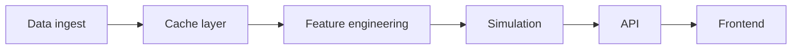

# ReadTheField

ReadTheField is a cache-first NFL player simulation system. It produces probabilistic distributions (not point estimates) for QB/RB/WR/TE/K outcomes using leakage-safe, matchup-aware features and Monte Carlo sampling.

## Quickstart (Local)
1. Refresh caches (long-running):
```
READTHEFIELD_SNAPSHOT_ID=20260121 Rscript scripts/refresh_weekly_cache.R --mode=full
```
2. Start the API:
```
export READTHEFIELD_REPO_ROOT="$(pwd)"
Rscript api/run_api.R
```
3. Start the frontend:
```
cd frontend
python3 -m http.server 5173
```
Open `http://localhost:5173` (API at `http://localhost:8000`).

## System Goals
- Cache-first, deterministic data pipelines
- Matchup-aware, leakage-safe feature engineering
- Probabilistic outputs with uncertainty bands
- Stable report schema + API contract
- Frontend consumes only documented endpoints

## Architecture (Pipeline Stages)
1. **Raw ingestion** (nflreadr snapshots)
2. **Cache layer** (`data/cache/*`)
3. **Feature engineering** (`data/processed/*`)
4. **Simulation** (read-only)
5. **API** (contracted responses)
6. **Frontend** (static UI)

## Cache vs Simulation Boundary (Strict)
- Cache refresh builds *all* data artifacts.
- Simulation is *read-only*: it must never create caches.
- API startup enforces repo-root execution for consistent paths.

## Diagram (Simplified)


## API Contract
All endpoints return exactly:
- Success: `{ ok: true, data: {...} }`
- Failure: `{ ok: false, error_code, message, details }`

Endpoints:
- `GET /players`
- `GET /teams`
- `GET /seasons`
- `GET /player/:id/games`
- `GET /player/:id/next_game`
- `POST /simulate`

## Troubleshooting
- **API won’t start**: ensure `READTHEFIELD_REPO_ROOT` is set and `data/cache` exists.
- **/players or /seasons empty**: validate `data/cache/player_directory.parquet` and `data/cache/player_week_identity.parquet`.
- **/simulate fails**: inspect `error_code`, check required feature caches in `data/processed/*`.
- **Frontend cannot load**: ensure API is running at `http://localhost:8000`.

## Local Test Checklist
1. `export READTHEFIELD_REPO_ROOT="$(pwd)"`
2. `Rscript api/run_api.R`
3. `curl -s http://localhost:8000/teams | jq '.ok, (.data.teams|length)'`
4. `curl -s http://localhost:8000/players | jq '.ok, (.data.players|length)'`
5. `curl -s http://localhost:8000/seasons | jq '.ok, (.data.seasons|length)'`
6. `cd frontend && python3 -m http.server 5173`

## Repo Structure
- `R/` core simulation engine, features, models, policies
- `scripts/` cache refresh + smoke tests
- `data/` cache + processed artifacts
- `docs/` schema + engineering notes
- `api/` plumber API
- `frontend/` static UI
- `archive/` historical scripts and notes
